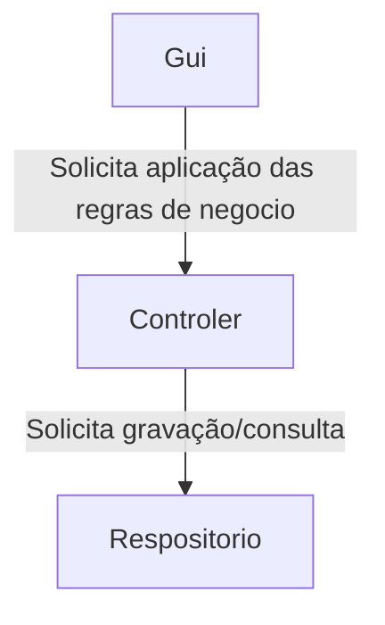

# POO-POOIB

## Sobre
* Projeto academico para servir de exemplo aos alunos da disciplina de programção orientada a objetos
* O POO-POOIB *(POO Internet Bank)* é um projeto para que os alunos possam aplicar conceitos de orientação a objetos como herança, polimofirmos, entre outros.

## Arquitetura
* O POO-POOIB utiliza uma arquitetura em camadas intermediária. Sendo as camadas devididas em:

| Camada      | Função                                                    |
|-------------|-----------------------------------------------------------|
| interface   | Camada responsável por ser a interface com o usuário      |
| controller  | Camada responsável pelas regras de negcio                 |
| repositorio | Camada responsável por persistencia dos dos dados         |
| entidades   | Camada responsável por abstrarir os objetos do mundo real |

### Entidades
* Suas classes models são Cliente, ContaCorrente, Poupanca.
